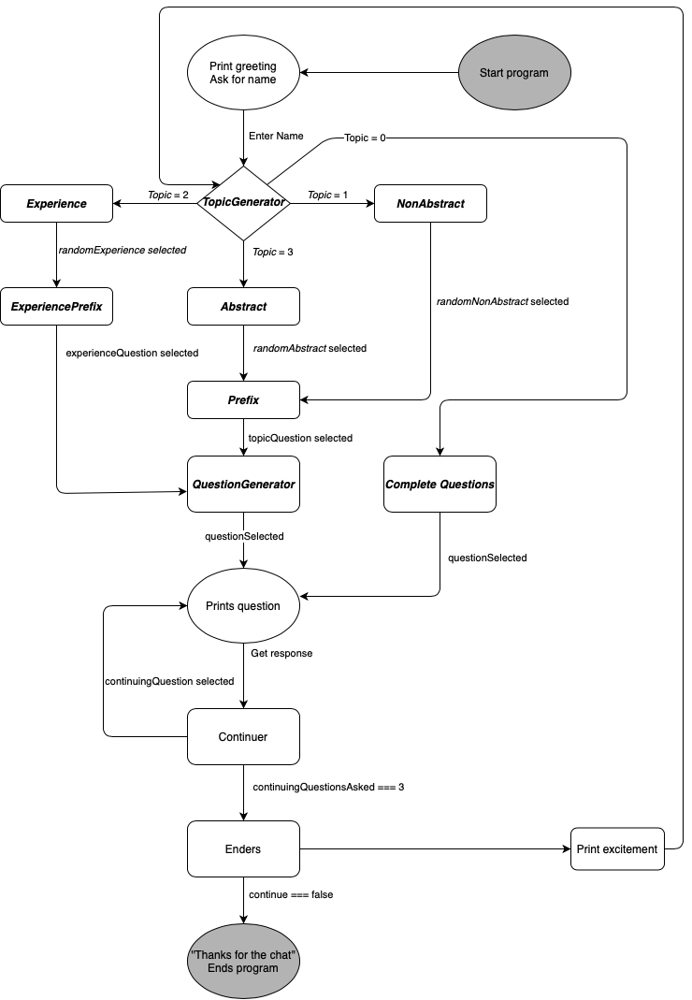

# BestFriend

  - [General Information](#general-information)
  - [Purpose of project](#purpose-of-project)
  - [Project architecture and design](#project-architecture-and-design)
    - [Initiation](#initiation)
    - [Selecting a topic](#selecting-a-topic)
    - [Generating a question](#generating-a-question)
    - [Continuing the conversation](#continuing-the-conversation)
    - [Ending the conversation](#ending-the-conversation)
  - [Tools](#tools)
  - [Setup](#setup)
  - [Next steps](#next-steps)
    - [Short term (1-2 months)](#short-term-1-2-months)
    - [Medium term (3-4 months)](#medium-term-3-4-months)
    - [Long term (5 months+)](#long-term-5-months)
  
## General Information
BestFriend is a simple light-weight application that generates random open-ended questions and analyzes the responses of the user to generate more closely defined questions.

## Purpose of project
1. Develop deeper understanding of:
    * JavaScript
    * Git/GitHub Technologies
    * Markdown
2. Understanding the different aspects of human conversations
3. (Long Term) Using these techniques to improve conversations in the future

## Project architecture and design 

### Initiation
When BestFriend is run using the command line, the system prints a greeting, followed by a prompt for the user to enter a name. After a name is entered, the `TopicGenerator` is initialized, which is the key to the whole application.

### Selecting a topic
The `TopicGenerator` selects a topic by randomly selecting a number from 0 to 3. The topics can be `Abstract` (1), `NonAbstract` (2), an `Experience` (3) or a `CompleteQuestion`(0) which does not need a prefix and a question generator. The four libraries relating to each topic are stored as `.txt` files and are read and written through the program itself.

### Generating a question
Aside from the `CompleteQuestion` selection that goes straight to printing the questions, the other 3 topics are concatenated with prefixes, with `Experience` needing a separate library of prefixes known as `ExperiencePrefix`. With the prefixes concatenated, the questions are now complete questions. They are fed into the `QuestionGenerator` function which formats the question to a readable format and prints.

### Continuing the conversation
When an answer is generated, a 'continuing' question is randomly selected from a library of open-ended questions known as a `Continuer` and the question is printed to keep the conversation going. When a `Continuer` has been printed 3 times, an ending phrase selected from a library of ending phrases known as `Enders` is randomly selected and printed. If the user indicates that they would like to `continue` the conversation, a random excitement phrase is printed and the program goes to the `TopicGenerator` and starts the process of [selecting a topic](#selecting-a-topic).

### Ending the conversation
When the user indicates that they would not like to `continue` the conversation, BestFreind prints a nice goodbye message and ends the program. On the back-end, the program saves the user responses throughout the runtime to an `topicAnswers.txt` file with `topic` being replaced with either `Abstract`, `NonAbstract`, `Experience` or `CompleteQuestions`. This is done to analyze user responses to improve the questions and/or the implementation of the system as well as detect bugs.

## Tools
* JavaScript
* Markdown
* Umple (For state machine modelling)
* Draw.io (For visuals)

## Setup
1. Open command line and `cd` to the `MixedMessages` folder
2. Type the command `node MixedMessages.js`
    * If you do not have Node.js installed, Simply go to the [Node.js Website](https://nodejs.org/en/) and download Node.js with the setup instructions
3. Enjoy!

## Next steps
### Short term (1-2 months)
* Update all question libraries with more questions to give a greater variety of flavours of conversations
* Implement a system of storing user responses to internal user profiles

### Medium term (3-4 months)
* Create a graphical front-end for the program using HTML and CSS
* Connect a database to the project

### Long term (5 months+)
* Use machine learning to create accurate user profiles
